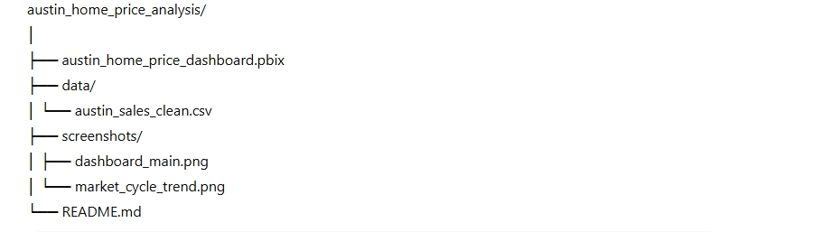

# Austin Housing Market Dashboard (2012–Present)

This dashboard analyzes the Austin, Texas housing market over time, highlighting **price trends, transaction volume, inventory conditions, and macro-level market phases.**

### 🎯 Key Insights
| Metric (Latest) | Value | Interpretation |
|---|---|---|
| **Median Sale Price** | **$507,000** | Prices remain above pre-2020 trend levels. |
| **YoY Price Change** | **-9%** | Market cooling after rapid 2020–2022 boom. |
| **Market Phase** | **2023–Present: Correction Phase** | Demand softening + increased inventory. |

---

### 📊 Dashboard Overview
- **Market Cycle Line Chart** — Shows clear phases:
  - *2012–2019: Normal Market*
  - *2020–2022: COVID Housing Boom*
  - *2023–Present: Correction Phase*
- **Inventory Trends** — Rising supply since 2023.
- **Homes Sold Volume** — Lower activity during correction years.

---

### 🧠 Why This Matters
This dashboard helps:
- **Homebuyers** understand price timing & risk
- **Investors** gauge market cycle conditions
- **Policy and planning teams** assess supply pressures

---

### 🛠 Tech Stack
| Component | Tool |
|---|---|
| Data Cleaning | Python / Pandas (optional) |
| Visualization | **Power BI Desktop** |
| Version Control | Git + GitHub |

---

### 📁 Project Structure

# Austin Home Price Analysis

---

### 🤝 Author
**Jack Okoth (@JackDatanerd)**  
_Data Analyst & Machine Learning Engineer_

